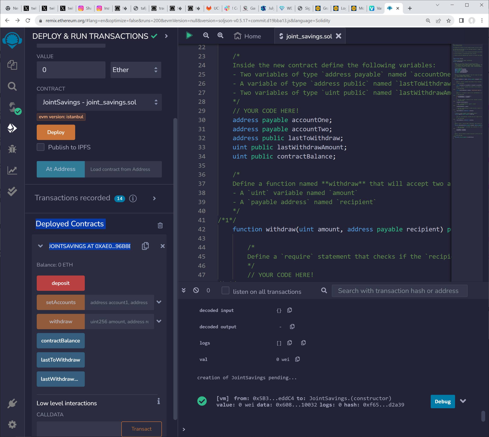
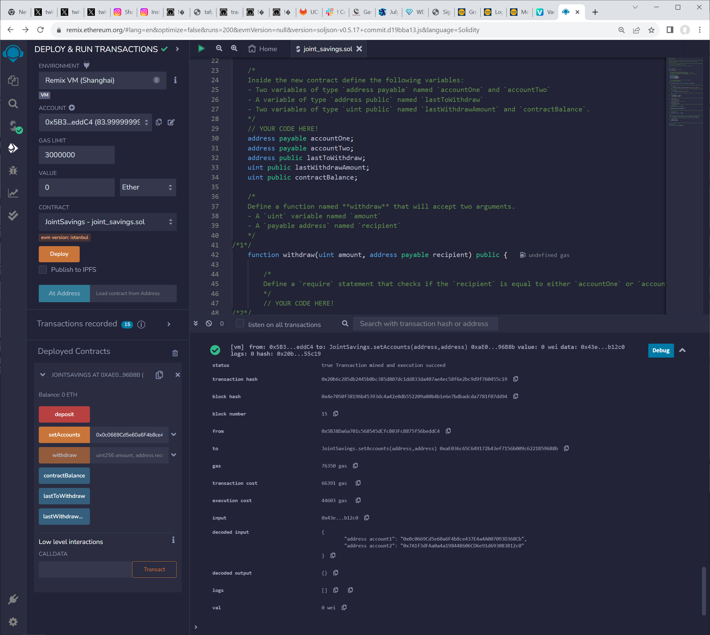
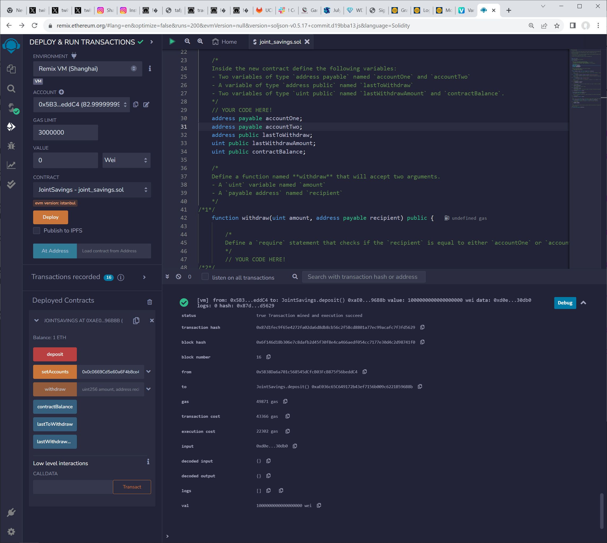
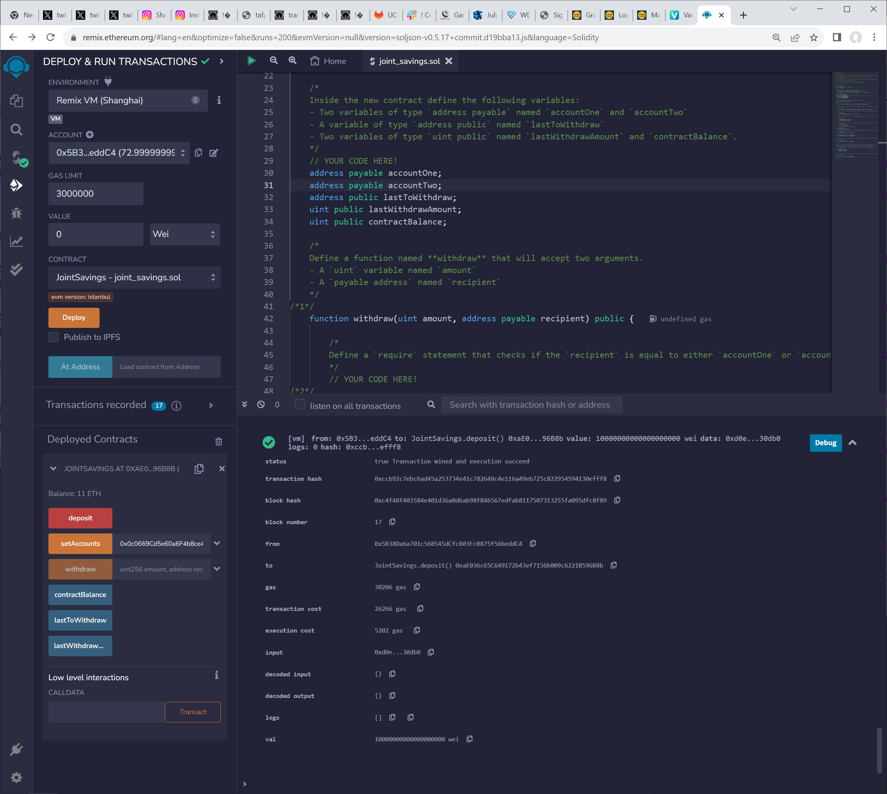
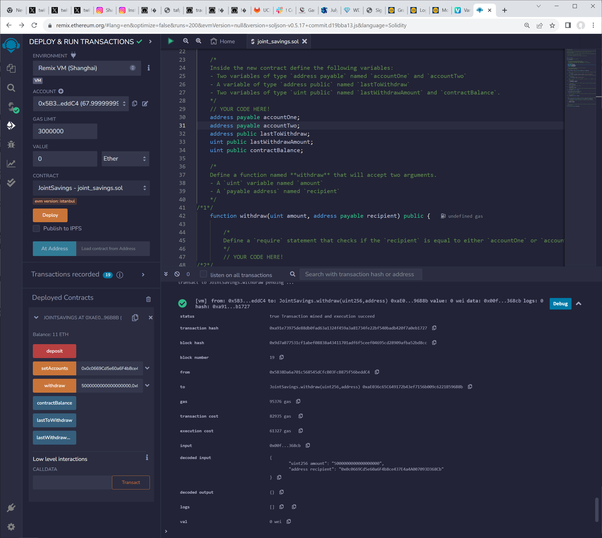
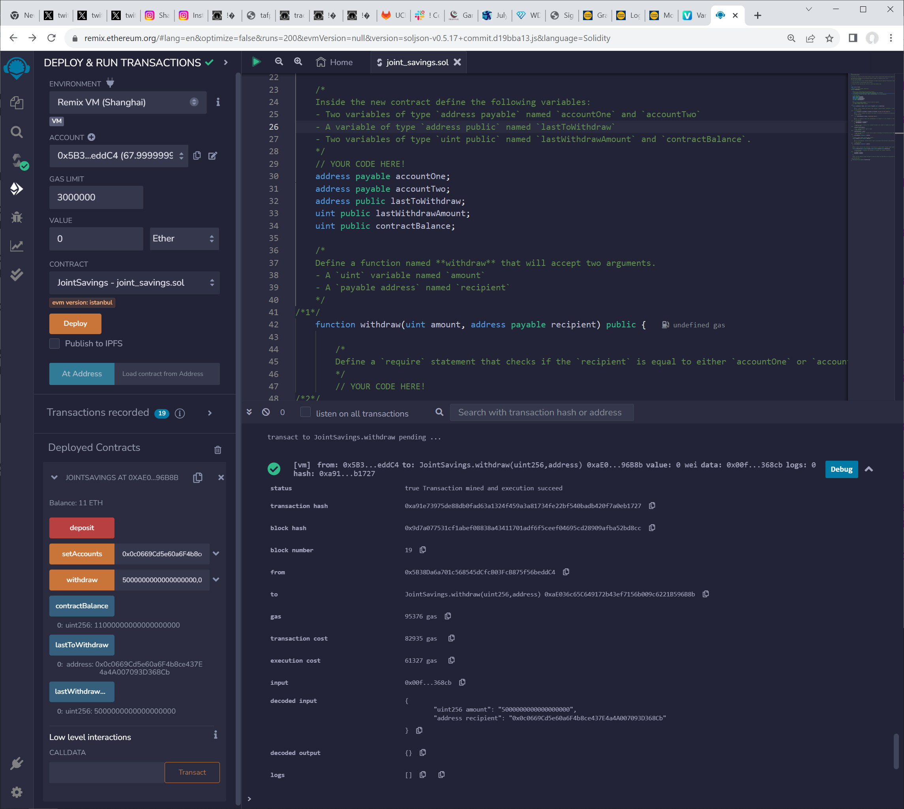
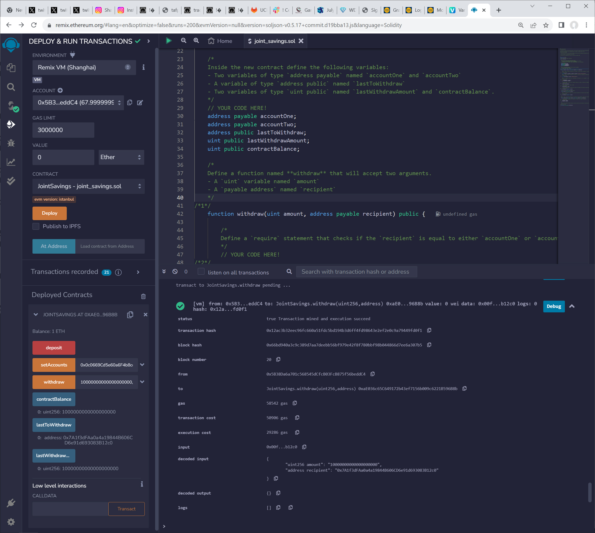

# Module-20-Challenge

FinTech Bootcamp Module 20 Challange due August 6, 2023

# Challenge - Build a Joint Savings Account Contract in Solidity

## Analysis

Build a Joint Savings smart contract in Solidity

## Purpose

We host smart contract for a joint savings accounts that accepts two addresses.

## Steps

#### Create a Joint Savings Account Contract in Solidity

#### Compile and Deploy Your Contract in the Remix VM

#### Interact with Your Deployed Smart Contract

### Remix VM Results

#### Deploy

#### Set Accounts

#### Deposit 1 Eth as Wei

#### Deposit 10 Eth as Wei

#### Deposit 5 Eth as Eth

#### Send 5 Eth as Account 1, Last To Withdrawal, Last Withdraw Amount

#### Send 10 Eth as Account 2, Last To Withdrawal, Last Withdraw Amount

# github.com repository link

	https://github.com/NvPahrump/Module-20-Challenge

# Technologies

This app is designed for Solidity 0.5.17c on Remix with the Remix VM environment

## Source Files:

    README.md
    
	joint_savings.sol

##  Results Image Files:

    Execution_Results/1.jpg
    Execution_Results/2.jpg
    Execution_Results/3.jpg
    Execution_Results/4.jpg
    Execution_Results/5.jpg
    Execution_Results/6.jpg
    Execution_Results/7.jpg
    
# To run

## Open https://Remix.com

# Contributors

Randy Miyazaki modified fintech_finder.py for the class assignment

# License

Intended for Randy Miyazaki and Fintech Bootcamp class personnel
